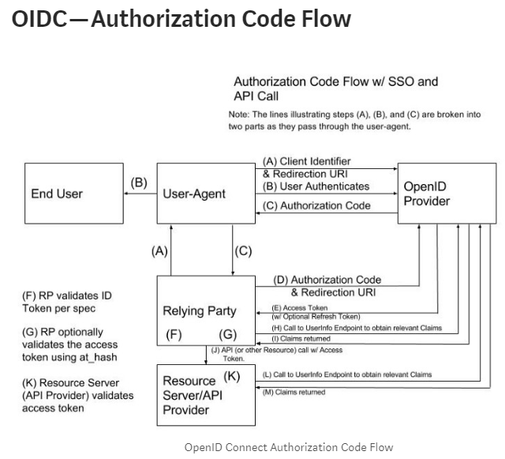
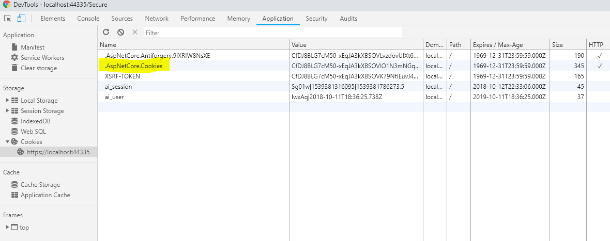
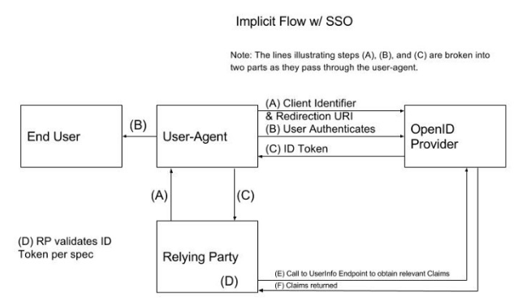
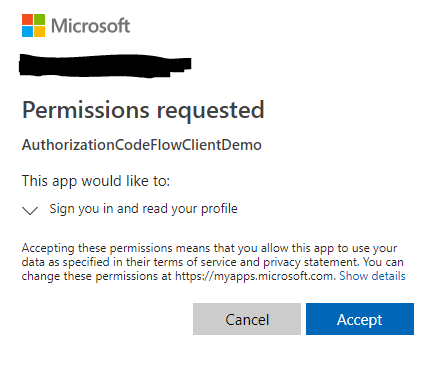
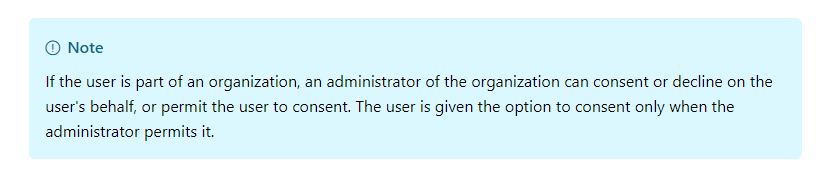
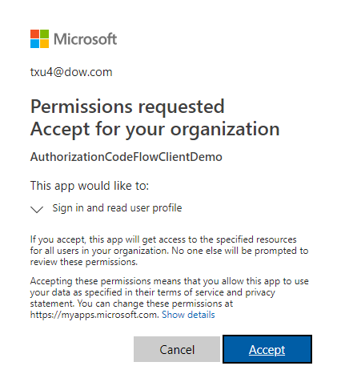
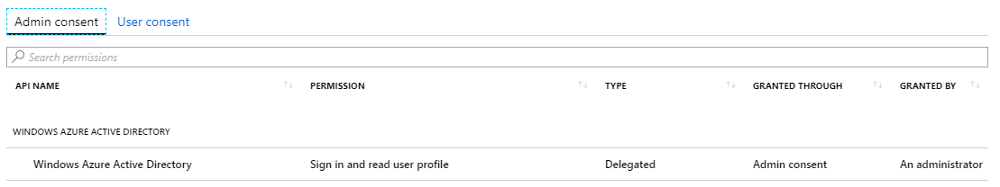
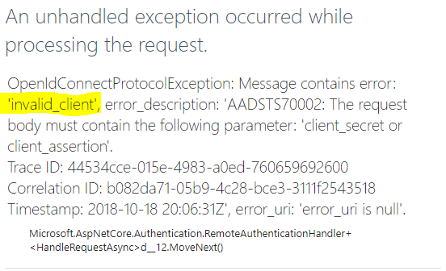

# Authentication & Authorization Tutorial

## Background: OpenID Connect vs OAuth 2
*`OAuth2` and `OpenID Connect` are only used when an identity provider (such as `Azure`, Facebook) is involved.*

 ### `OAuth2` 
 is a standard that supports users authorizing an application to access the user's info located on an identity provider (*such as `Azure`, Facebook*). `OAuth2` allows the application to get users’ info without getting the users’ passwords for the identity provider. `OAuth2` does this by having the identity provider issue access tokens to these 3rd party applications.

### `OpenID Connect` 
is an authentication standard on top of `OAuth2`, so anytime `OpenID Connect` protocols are used `OAuth` is also used. It follows `OAuth2` standards for authorization, but spells out how exactly authentication (*which must occur first before authorization can occur*) is done and how to get ID tokens.

## Helpful Links
[This resource](https://medium.com/@robert.broeckelmann/when-to-use-which-oauth2-grants-and-oidc-flows-ec6a5c00d864) is good at explaining the different kinds flows and what conditions each one should be used in.

For authentication and authorization, your application will most likely be using the Authorization Code Flow:



[Part Three](part-three-authorization-and-authentication-with-azure) walks through a simple implementation of the authorization code flow.

## Tutorial Overview

This tutorial has three parts, increasing in complexity, all of which use .NET Core applications. 

[Part One](#part-one-authentication-without-azure) walks through a way to use cookies to authenticate users directly to your C# application **without** using an authentication/authorization provider (such as AzureAD). This means that Part One doesn’t use OpenID Connect protocols. 

[Part Two](#part-two-authentication-with-azure) walks through authenticating users with AzureAD using OpenID Connect. 

[Part Three](#part-three-authorization-and-authentication-with-azure) walks through both authenticating a user to the application and also authorizing that application access to a separate API, again using Azure and OpenID Connect.

## Part One: Authentication without Azure
*Implemented in this solution as the `authentication` project*.


### The flow

1.	The user/browser hits a secure endpoint on the app server. The app server middleware sees that the user has no authentication cookie and so redirects the user to a predetermined login path (page). The user enters their username and password, and clicks the Login button, which calls a login method on the app server.
1. The login method validates the username and password. If valid, the server creates a ClaimsPrincipal, wraps it in a cookie, and returns the cookie to the browser with the response. This cookie now becomes the single source of truth of authentication for that user/browser.
1. Every time the user/browser makes another request to the app server, the cookies associated with that app is sent to the server. The app server middleware receives the cookie and validates it.

### Step By Step Tutorial
[Microsoft Reference Docs](https://docs.microsoft.com/en-us/aspnet/core/security/authentication/cookie?view=aspnetcore-2.1&tabs=aspnetcore2x)
1.	Create an empty .NET Core MVC app, then add a **HomeController** and a **SecureController**, both with their own views. [Create a simple .NET Core app](https://www.iambacon.co.uk/blog/create-a-minimal-asp-net-core-2-0-mvc-web-application)
2.	Enable the app to run on SSL: Right click on the project >> select **Properties**. In the Debug tab, select **Enable SSL**. Copy the **SSL URL** and replace the **App URL** with it. Save.
Select Enable SSL. Copy the SSL URL and replace the App URL with it. Save.
3.	Create a path to a secure page: In the **HomeController** view, add a link to the **SecureController** view. In the **SecureController**, add an `[Authorize]` tag above the class to force users to authenticate before accessing the page.
4.	Create the authentication middleware: Add two pieces of code in `Startup.cs`:
```csharp
// in ConfigureServices in Startup.cs file:
// tells the application to use cookies to authenticate users
services.AddAuthentication(CookieAuthenticationDefaults.AuthenticationScheme)
    .AddCookie();

// in Configure in Startup.cs file, ABOVE app.UseMvc() line:
app.UseAuthentication();
```
5. Create a login page: Create an **AccountController** and view. Edit **ConfigureServices** in `Startup.cs` by adding a login path to that view:
```csharp
// redirects user to this path when request for secure endpoint doesn't have valid authentication cookie
services.AddAuthentication(CookieAuthenticationDefaults.AuthenticationScheme)
    .AddCookie(options => {
        options.LoginPath = "/Account/Index/";
    });
```
6. Implement log in: Create a Login method in **AccountController**:
```csharp
public async Task<IActionResult> Login(string returnUrl)
{
    var claims = new List<Claim>
    {
        new Claim(ClaimTypes.Name, "johndoe@gmail.com")
    };

    var claimsIdentity = new ClaimsIdentity(claims, CookieAuthenticationDefaults.AuthenticationScheme);

    // creates an encrypted cookie and adds it to the current response
    await HttpContext.SignInAsync(
        CookieAuthenticationDefaults.AuthenticationScheme,
        new ClaimsPrincipal(claimsIdentity));

    return RedirectToAction("Index", "Secure");
}
```
7. Add a link to the Login endpoint from the **AccountController** view. Now when you run the application and open Dev Tools at the `Secure` page, you should see the cookie:

8. Implement log out: Create a **Logout** method in **SecureController** that redirects to the **HomeController** view on successful log out:
```csharp
public async Task<IActionResult> Logout()
{
    await HttpContext.SignOutAsync(CookieAuthenticationDefaults.AuthenticationScheme);
    return RedirectToAction("Index", "Home");
}
```
9. Add a link to the **Logout** endpoint in **SecureController** view.
10. Test that authentication is working: after logging out the user needs to log in again to access the `Secure` page, but if the user doesn't log out they can go between `Home` page and `Secure` page without seeing the `Login` screen. The cookie in the browser will also appear and disappear accordingly.
11. You can play with `ExpireTimeSpan` and `SlidingExpiration` options (in `Startup.cs` >> **ConfigureServices** >> .AddCookie()), to see the cookie expire without having to wait a long time.


## Part Two: Authentication with Azure
*Implemented in this solution as the `azureAuthenticationOnly` project*.

This part will create a "federated" application, one that uses an external Identity Provider (e.g. Azure) to authenticate users. The implementation uses OpenID Connect.


### The flow
1.	The user/browser hits a secure endpoint on the app server. The app server middleware sees that the user has no authentication cookie and so redirects the user to [Azure's Authorization Endpoint](https://connect2id.com/learn/openid-connect#endpoints) to login. The redirect to Azure also contains in the query string the redirect url (app server endpoint), the client identifier, and type of response wanted from Azure (ID token), among other things:

1. The user logs in to Azure.
1. Azure verifies that the user is registered for the application with the given client id, and if successful again redirects the user/browser back to the app server using the redirect url. Along with the redirect, Azure also sends an [ID Token](#json-web-tokens) as payload to the user/browser.
1. The app server receives the ID Token in the redirect, and verifies it. The user is now logged in.
1. The app server directly hits Azure's UserInfo Endpoint with the ID Token??
1. Azure returns claims on the user.

#### JSON Web Tokens
.NET Core sends ID tokens and access tokens as JSON Web Tokens (JWT), which are JSON objects containing key/value pairs of claims. You can copy any JWT into a site like jwt.io and see the list of claims and their values, which can come in handy while debugging your application.

### Step By Step Tutorial
1.	Follow [Part One](#part-one-authentication-without-azure) steps 1 through 3.
1. Register your application with Azure. Follow [this tutorial](https://www.c-sharpcorner.com/article/azure-ad-with-asp-net-core-2-0/) starting with `"Once directory is created, we need to register our application"`.
1. Create the authentication middleware: Add two pieces of code in `Startup.cs`:
```csharp
// in ConfigureServices in Startup.cs file:
// tells the application to use cookies to authenticate users
services.AddAuthentication(options => 
    {
        options.DefaultAuthenticateScheme = CookieAuthenticationDefaults.AuthenticationScheme;
        options.DefaultSignInScheme = CookieAuthenticationDefaults.AuthenticationScheme;
        options.DefaultChallengeScheme = OpenIdConnectDefaults.AuthenticationScheme;
    })
    .AddCookie();

// in Configure in Startup.cs file, ABOVE app.UseMvc() line:
app.UseAuthentication();
```
The default challenge scheme sets up the middleware to use OpenID Connect when users who are not logged in try to access a secure page. However, the middleware will check the requests for cookies before using OpenID Connect to sign users in.

4. Add AddOpenIdConnect options in `Startup.cs`:
```csharp
services.AddAuthentication(options =>
    {
        // stuff
    })
    .AddOpenIdConnect(options =>
    {
        // tenant is the name of your active directory in Azure
        options.Authority = "https://login.microsoftonline.com/<tenantname>";
        // application id in Azure (Registered Apps)
        options.ClientId = "<clientid>";
        // only want an id token from Azure
        options.ResponseType = OpenIdConnectResponseType.IdToken;
        // reply url in Azure, redirects user to after sign in
        options.CallbackPath = "/security/signin-callback";
    })
    .AddCookie();
```
These fields provide the necessary information when signing in to Azure (see step 1 in the Flow):


5. Create a **Logout** endpoint in **SecureController**:
```csharp
public async Task Logout()
{
    // deletes the cookie from the browser
    await HttpContext.SignOutAsync(CookieAuthenticationDefaults.AuthenticationScheme);
    // logs the user out from Azure
    await HttpContext.SignOutAsync(OpenIdConnectDefaults.AuthenticationScheme);
}
```
Also add a link on the **SecureController** page to this method.

6. In `Startup.cs` add endpoint to hit after logout in ConfigureServices:
```csharp
services.AddAuthentication(options =>
    {
        // stuff
    })
    .AddOpenIdConnect(options =>
    {
        // stuff
        options.SignedOutRedirectUri = "https://localhost:44369/<loggedoutpage>";
    })
    .AddCookie();
```
On logout, the user/browser will be redirected to that page.
## Part Three: Authorization and Authentication with Azure
*Implemented in this solution as the `authorizationCodeFlow` client app project and `authorizationCodeFlowApi` API project*.

This part has an client application that needs to authenticate users, and also needs authorization to access an API protected behind Azure. In this example the client app accesses the API on behalf of users, which allows different users to have different access to the API. This type is also a federated application.

This part follows the [Authorization Code Flow](https://medium.com/@robert.broeckelmann/when-to-use-which-oauth2-grants-and-oidc-flows-ec6a5c00d864), considered the most secure flow for authentication and authorization because only the authorization code is exposed to the browser. The ID token and access token are sent directly from the identity provider to the client app's server.

Get more info with [Microsoft's docs](https://docs.microsoft.com/en-us/azure/active-directory/develop/v1-protocols-oauth-code).


### The flow
1. The user/browser hits a secure endpoint on the client app server. The client app middleware sees that the user has no authentication cookie and so redirects the user to [Azure's Authorization Endpoint](https://connect2id.com/learn/openid-connect#endpoints) to login. The redirect to Azure also contins in the query string the redirect url (client app server endpoint), the client app identifier in Azure, and type of response wanted form Azure (authorization code), among other things:

Notice that `response_type` has value `code` now.
1. The user logs in to Azure.
1. Azure verifies that the user is registered for the application with the given client id, and if successful again redirects the user/browser back to the client app using the redirect url. Along with the redirect, Azure also sends an authorization code, which is specific to both that user and that client app.
1. The client app server receives the authorization code in the redirect and sends the code, client app id and secret, and client app redirect url to [Azure's Token Endpoint](https://connect2id.com/learn/openid-connect#endpoints) in exchange for an ID token and an access token.
1. Azure returns the ID token and access token back to the client app.
### Step By Step Tutorial
1.	Follow [Part One](#part-one-authentication-without-azure) steps 1 through 3.
1. Just like in [Part Two](#part-two-authentication-with-azure) step 2, register your app with Azure.
1. Now create an API project: In the same solution, create an empty .NET Core MVC app. Run `"Install-Package Microsoft.AspNetCore.Mvc"` in Package Manager Console, then modify `Startup.cs` file:
```csharp
// in ConfigureServices function add the following:
services.AddMvc();

// in Configure function add only two lines:
app.useAuthentication();
app.UseMvc();
```
Since this is an API there's no need for routing.

4. Turn SSL on for the API app, just like for the client app.
5. In the API app, create a PetsController with no corresponding view, with an unprotected endpoint and a protected endpoint:
```csharp
[Route("api/[controller]")]
public class PetsController : Controller
{
    [HttpGet]
    public ActionResult Get()
    {
        return Ok(new List<string>() { "cat", "dog", "bird"});
    }

    [Authorize]
    [HttpGet("{number}")]
    public ActionResult Get(int number)
    {
        return Ok(new List<string>() { "cow", "duck", "koala"});
    }
}
```
Run the API, and you should be able to hit the unprotected endpoint (`https://localhost:#####/api/pets`) and get data back, but receive a `500` error when hitting the protected endpoint.

6. Register the API in Azure.
7. [Fix the API](https://github.com/IdentityServer/IdentityServer4/issues/1466) so it returns 401 error (unauthorized) when hitting its protected endpoint. Add these lines in `Startup.cs`:
```csharp
// in ConfigureServices method
services.AddAuthentication(options =>
{
    options.DefaultAuthenticateScheme = JwtBearerDefaults.AuthenticationScheme;
    options.DefaultChallengeScheme = JwtBearerDefaults.AuthenticationScheme;
})
.AddJwtBearer(options =>
{
    options.Authority = "https://login.microsoftonline.com/<tenantname>";
    // this refers to the client app server--the App Id of application calling this API with an access token
    options.Audience = this.ClientId;
});
```
This tells the middleware to check incoming requests for tokens to authenticate users, what the Active Directory tenant is, and which application is requesting the API resource. Now the protected endpoint will return 401.

8. Just like in Part Two, start to configure your client (non-API) `Startup.cs` file:
```csharp
// in ConfigureServices:
services.AddAuthentication(options =>
{
    options.DefaultScheme = CookieAuthenticationDefaults.AuthenticationScheme;
    options.DefaultChallengeScheme = OpenIdConnectDefaults.AuthenticationScheme;
})
.AddOpenIdConnect(options =>
{
    /* this section has information used to obtain an authorization code from Azure */
    options.Authority = "https://login.microsoftonline.com/<tenantname>";
    // application id in Azure
    options.ClientId = this.ClientId;
    // the redirect_uri, must match one on Azure
    options.CallbackPath = "/security/signin-callback";
    // using the authorization code flow
    options.ResponseType = OpenIdConnectResponseType.Code;
})
.AddCookie();

// in Configure function:
app.UseAuthentication();
```
The response type for this client app is `code`, which means that after an unauthenticated user signs into Azure, Azure will redirect the user/browser back to the client app with an `authorization code`, NOT an ID token, NOT an access token. [Read here](https://sazzer.github.io/blog/2016/09/03/OpenID-Connect-Response-Types/) to see how different **ResponseTypes** in the `.AddOpenIdConnect` middleware maps to different things returned to the client app from Azure. 
In the case of `code` response type, the flow for authorization looks like the first [diagram here](https://medium.com/@darutk/diagrams-of-all-the-openid-connect-flows-6968e3990660).

9. Configure the client app permissions in Azure. Currently when the client app is run and the user tries to hit a protected endpoint, this page is shown after the user signs in to Azure:


This page appears because Azure needs to get permission from the user before letting the client app receive an id token and access token from Azure. As this [tutorial](https://docs.microsoft.com/en-us/azure/active-directory/develop/v1-protocols-oauth-code) explains:


You can leave this feature as is, or have an admin accept on behalf of all users of the client app:

- Go to portal.azure
- Select Active Directory, then Enterprise Apps
- Select your client app, then Permissions
- Click `"Grant admin consent for <name of Active Directory>"`. You will be pronpted to log in as an admin for that AD.
- Then you see: 
- Click **Accept**. Now the admin of the Active Directory has given permission for the client app to access information on all users in that Active Directory.
- On Azure, you should now see: 

10. Create a client secret for the client app: Currently when you run the application, after the user successfully signs in to Azure and is redirected back to the client app, there is a `500` error:


The error says that the client app is missing a `client secret`, which Azure uses to make sure the client app really is the client app. To fix this, [create the client](https://www.netiq.com/communities/cool-solutions/creating-application-client-id-client-secret-microsoft-azure-new-portal/) secret, then add ClientSecret as an option in `.AddOpenIdConnect`.

11. Call the API from the client app. Create an endpoint in SecureController that asks the API for the protected list of pets:
```csharp
public async Task<string> GetAnimals()
{
    if (User.Identity.IsAuthenticated)
    {
        string accessToken = await HttpContext.GetTokenAsync("access_token");
        string idToken = await HttpContext.GetTokenAsync("id_token");

        HttpClient client = new HttpClient();
        client.BaseAddress = new Uri("https://localhost:44331/");
        client.DefaultRequestHeaders.Accept.Add(new MediaTypeWithQualityHeaderValue("application/json"));
        client.DefaultRequestHeaders.Authorization = new AuthenticationHeaderValue("Bearer", accessToken);
        var response = await client.GetAsync("api/pets/5");

        if (response.IsSuccessStatusCode)
        {
            var animals = await response.Content.ReadAsStringAsync();
            return animals;
        }
    }
    return "Bad Request";
}
```
Also have to [add another option](https://www.jerriepelser.com/blog/accessing-tokens-aspnet-core-2/) to ConfigureServices “options.SaveTokens = true”. The `ID token` and `access token`, obtained from Azure, can be accessed from where they are cached by .NET Core in memory. The `access token` is passed to the API in the GET call. Add a link in the SecureController view to the GetAnimals endpoint.

12. Request an `access token`. Currently when running both applications together, and the user tries to get the list of animals from the API, the API returns 401 Unauthorized. If we put a breakpoint in the GetAnimals function in the client app, we see that the `access token` returned isn’t a JWT. It appears that we have to manually ask Azure for ID and `access token`s using the authenticate code received. In the client app’s ConfigureServices, [edit the OnAuthorizationCodeReceived event](https://docs.microsoft.com/en-us/dotnet/api/microsoft.identitymodel.clients.activedirectory.authenticationcontext.acquiretokenbyauthorizationcodeasync?view=azure-dotnet#Microsoft_IdentityModel_Clients_ActiveDirectory_AuthenticationContext_AcquireTokenByAuthorizationCodeAsync_System_String_System_Uri_Microsoft_IdentityModel_Clients_ActiveDirectory_ClientCredential_System_String_) to use the AcquireTokenByAuthorizationCodeAsync method:
```csharp
OnAuthorizationCodeReceived = async (ContextBoundObject) =>
{
    ClientCredential credentials = new ClientCredential(this.ClientId, this.ClientSecret);

    var authContext = new AuthenticationContext(ContextBoundObject.Options.Authority);
    // last variable (resource) is the id of the client app, which receives the token
    var result = await authContext.AcquireTokenByAuthorizationCodeAsync(
        ContextBoundObject.ProtocolMessage.Code,
        new Uri(ContextBoundObject.Properties.Items[OpenIdConnectDefaults.RedirectUriForCodePropertiesKey]), credentials, this.ClientId);

    // tell middleware that we already handled the code redemption
    ContextBoundObject.HandleCodeRedemption(result.AccessToken, result.IdToken);
}
```
