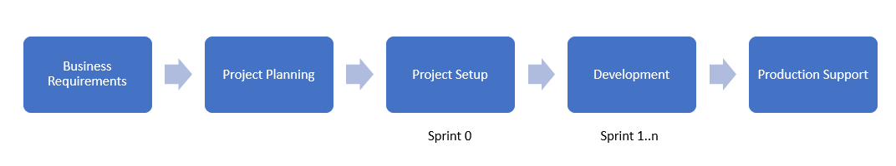
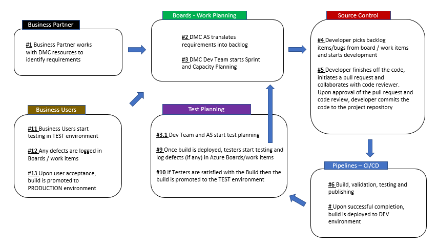
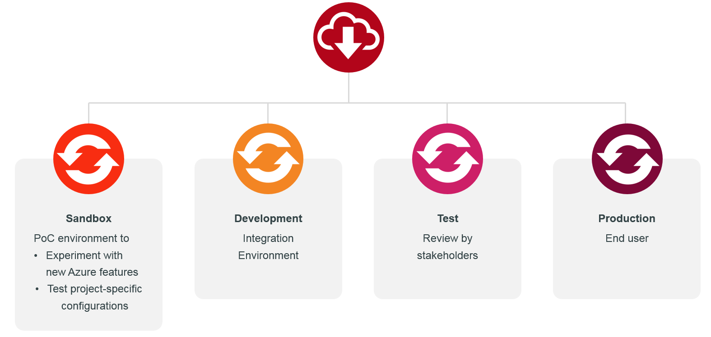
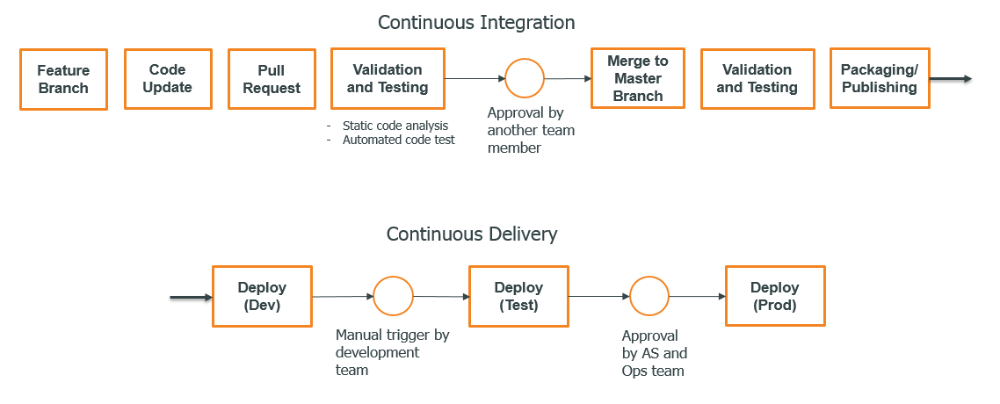
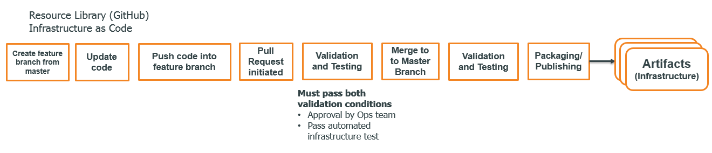
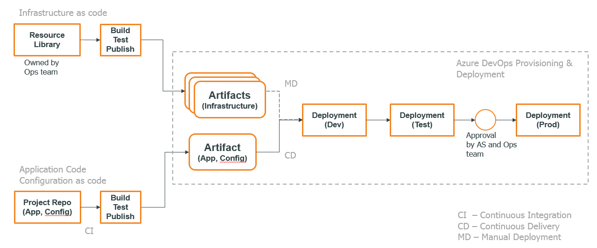
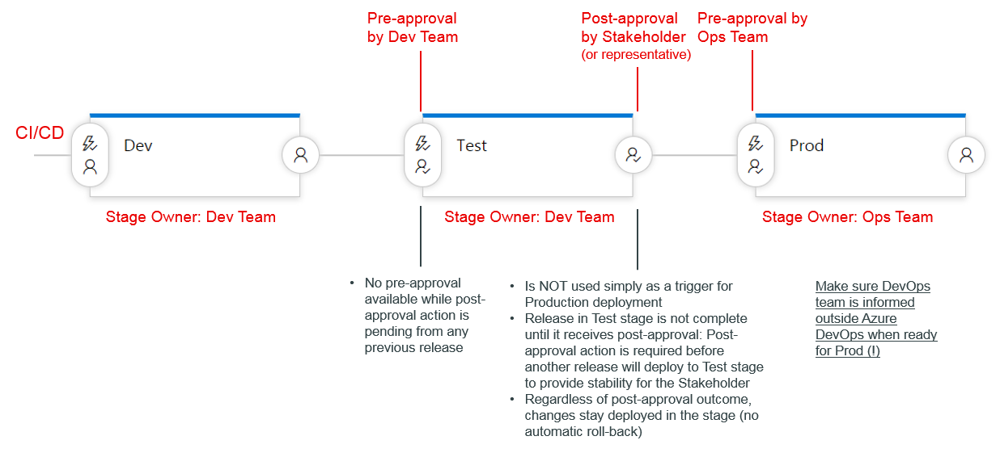
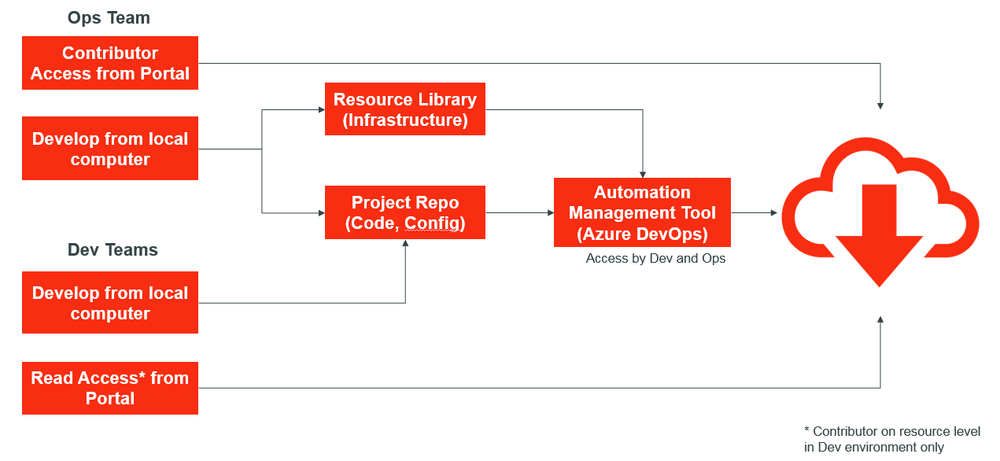
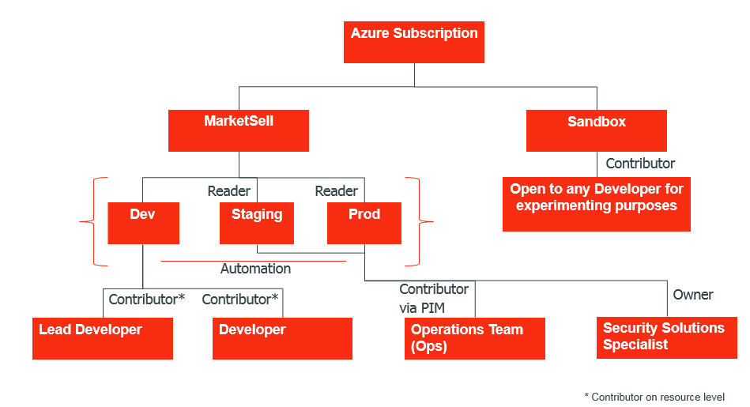

# DevOps Overview

## Introduction
This page provides a high level overview of the general project software development workflow in place for the Chicago DMC. In addition, it describes the DevOps-related processes and tools used for software development.

## Roles
The following list summarizes the different teams and roles that occur in this document:
- AS – Architecture Specialist
- Ops team - Operations/Platform team
- Dev team - Development team
- Lead developer
- Security Solutions Specialist (embedded security specialist)

## Project Workflow

### Business requirements
- AS defines product requirements with business partner

### Project Planning
- Initial sprint and capacity planning
- Architectural design review

### Project Startup Phase
The project startup phase typically takes place in Sprint 0 and typically includes the following major steps
- Create project repository
- Provision and configure cloud resources using Infrastructure as Code (IaC)
- Set up build and release pipelines using Continuous Integration (CI) and Continuous Delivery (CD)
- Create cloud app registrations using IaC, request admin consent
- Request developer access to created cloud resources
- Request adding necessary Azure SQL database roles and users for automation and development
- Request adding user groups to app registration
- Initiate risk assessment

### Development Phase
The software development process is described in the following diagram:

In addition to the software development activities described above, the following ongoing processes take place during the Development Phase:
- Risk assessment and validation (Typical duration: weeks)
- Refinements in infrastructure configurations using IaC

### Production Support
TBD

## DevOps

### Definitions

#### [DevOps](#devops)
DevOps is the union of people, process, and tools to enable continuous delivery of value to our end users. 

#### Continuous Integration
Continuous Integration (CI) is a development practice that requires developers to integrate code into a shared repository several times a day. Each check-in is then verified by an automated build, allowing teams to detect problems early.

#### Continuous Delivery
Continuous delivery is a series of practices designed to ensure that code can be rapidly and safely deployed to production by delivering every change to a production-like environment and ensuring business applications and services function as expected through automated testing. Since every change is delivered to a staging environment using complete automation, you can have confidence the application can be deployed to production with a push of a button when the business is ready.

### Environments

A Sandbox environment is not part of any official DevOps pipeline and is used only for Proof of Concepts (PoC) and experimental purposes.

A Dev environment is used as the first stage in the DevOps delivery pipeline and serves as a testing environment for Dev teams to test continuously integrated changes.

A Test environment is used to review implementations with stakeholders and business partners.

A Prod environment is where the live application lives.

Dev, Test and Prod environments typically have the same configurations, ensuring consistency across environments and thereby increasing the number of successful deployments.

### Application Delivery Pipeline
The following diagram describes the application delivery workflow:

 
In the Continuous Integration (CI) phase, a developer applies changes to the code base on a feature branch and initiates a pull request (PR). Code validation and testing is triggered automatically as part of the PR. Merging to the Master branch kicks off further validation and testing and eventually the publishing step. It is recommended that one create a PR early in the development process so that others can provide timely feedback on the implementation.

The Continuous Delivery (CD) phase is automatically triggered after the publishing step from CI is complete. The code package is first deployed to a Development (Dev) environment. The development team can send the code update further to the Test environment once the application state is ready for review by the AS and typically one or more business partners. Once the AS and the Ops team approve the changes present in Test, the changes are automatically deployed to production.

Note that a project repository includes not only the application code but also all necessary infrastructure configurations by leveraging Infrastructure as Code (IaC). More on this in the Infrastructure as Code section.

### Infrastructure as Code

#### Resource Library
In order to ensure reusability and consistency across environments and projects, Infrastructure as Code (IaC) is used for environment creation and modification. Furthermore, in order to simplify the provisioning of new cloud resources and provide default configurations, infrastructure templates are available in a centralized repository, called the Resource Library (RL). This a version control repository where IaC templates are stored. The templates are primarily developed and provided by the Ops team and go through rigorous infrastructure testing before making them available for use to development teams.
The following integration pipeline is used for publishing IaC templates:

 
#### Application Repository
Application projects often need custom modifications and updates in infrastructure configuration. In order to enable for this scenario, project-specific configurations are stored in the application repository in the form of scripts.

#### All Together: CI/CD and IaC
The following diagram illustrates the CI/CD workflow combined with IaC:

Note the two different version control sources. The app repository includes both the application code base and Configuration-as-Code (CaC) scripts. The list of IaC templates in use is defined in an Azure DevOps release pipeline along with any other deployment steps. The CD pipeline is the same as the one introduced in the Application Delivery Pipeline section.

To combine different infrastructure templates and thereby define custom infrastructure setups (cloud architectures), Azure DevOps is used as a tool. Leveraging Azure DevOps, one can quickly define the right combination of IaC templates.

#### More on Approval Steps
The following workflow describes the approval process in more detail:

Note the difference between post-approval performed by AS in the Test stage and the pre-approval done by the Ops team before deploying to production. 

### Tools in Use

#### Primary Technology stack
- Azure cloud (PaaS) – Cloud
- Azure Active Directory – Identity and Access Management
- .NET and .NET Core – Software framework
- Entity Framework and Entity Framework Core – ORM framework
#### DevOps Tools
- Azure DevOps – Automation Management Tool, CI/CD
- Checkmarx – Static Code Scan Analysis
- Azure ARM templates – IaC
- Powershell – IaC and CaC

## Security
### DevOps Security
The following workflow shows the basic DevOps workflow in a security context:

Dev teams have read-level access to cloud resources by default. In Dev environments, a Dev team has additional contributor-level access to cloud resources. A contributor can apply any modifications on the cloud resource directly from a local workstation. Note that the contributor access in Dev is given on the resource level. Consequently, a developer cannot add or delete resources in the cloud resource group or remove the entire resource group itself.

Ops team has full contributor access on the cloud subscription level.

Both Dev and Ops teams have access to the automation management tool (Azure DevOps). Every change in configuration or code needs to go through the DevOps pipeline. 

A Security Solutions Specialist has full owner-level access to the subscription (not shown in the diagram) who can grant others access to cloud resources.

### Access to Environments
The chart below shows the access given to different roles in the context of environments:

Note that developers have elevated access in Dev environment to ensure fast-paced debugging and troubleshooting. This implies a need for discipline from any Dev team such that they solidify changes by updating IaC definitions and/or application code in the project repository once a problem has been resolved. This is a necessary step as the only way to apply the same changes in any environment other than Dev and Sandbox is to push updates through the DevOps pipeline. This strategy ensures consistency across environments while also giving Dev teams the flexibility to find the right solution to any problem within a reseasonable time.
