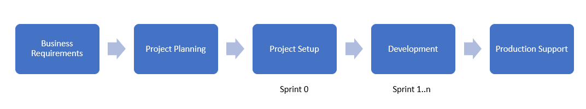
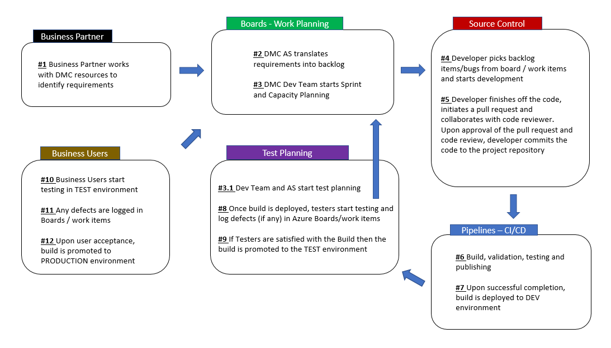
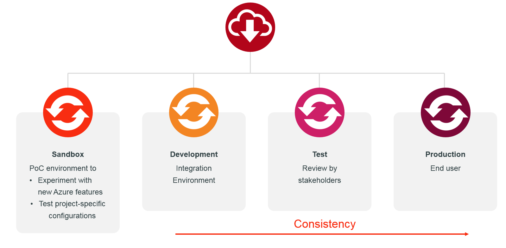
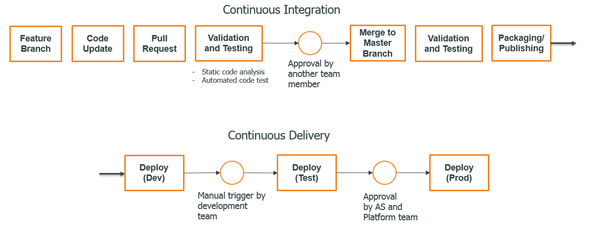
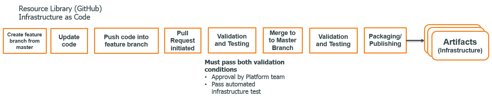
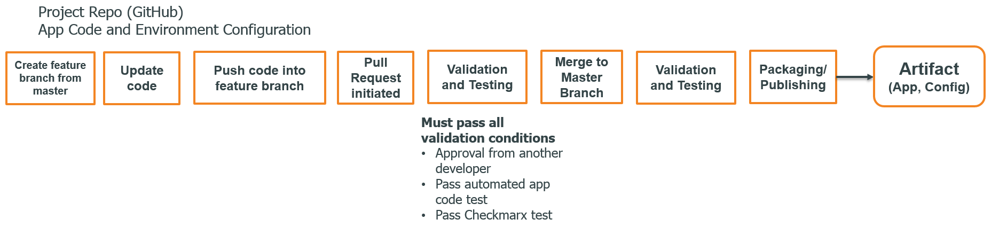
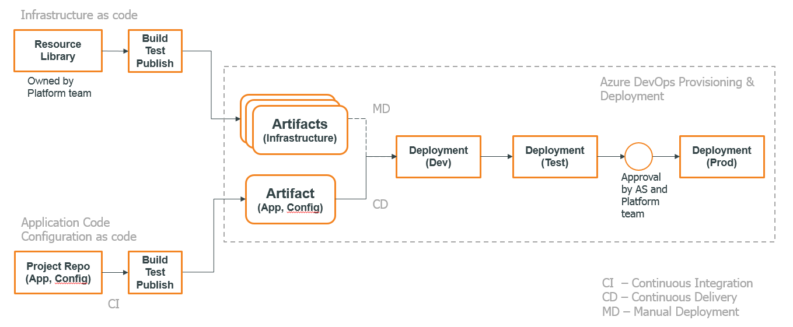
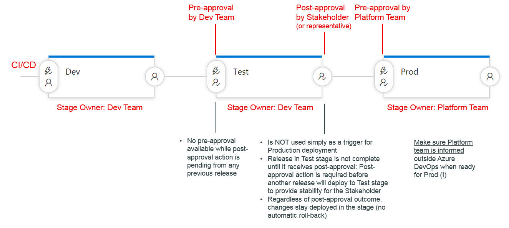
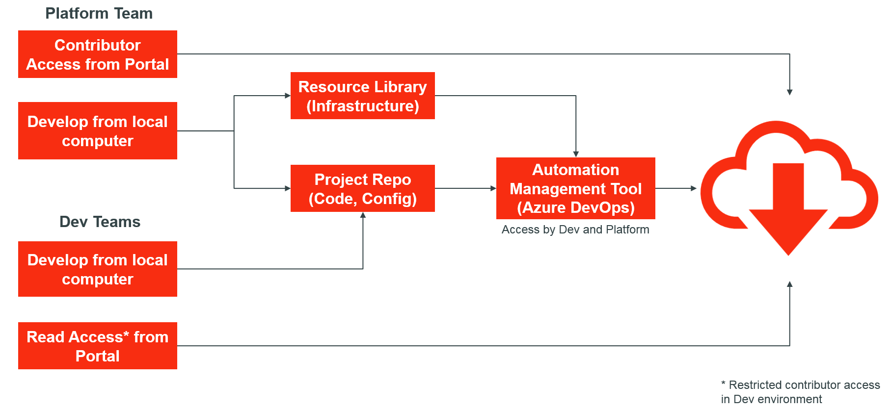
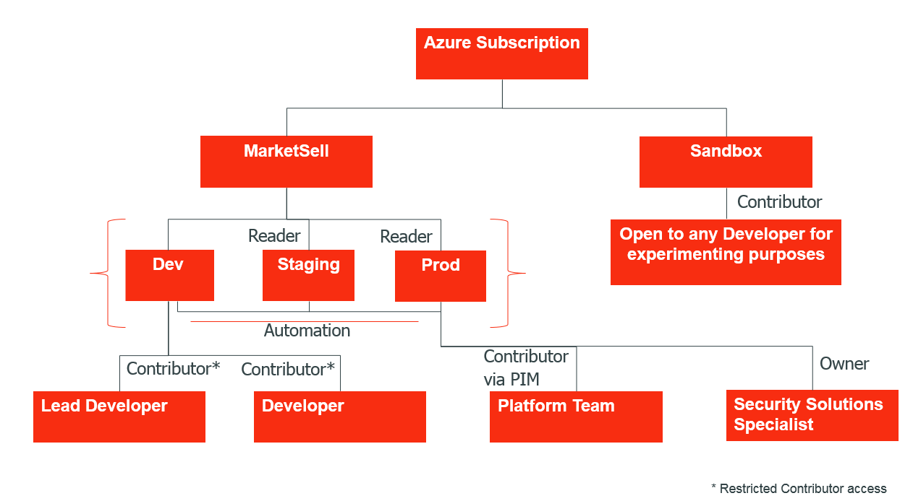

# DevOps Overview

## Introduction
This page provides a high-level overview of the software development process, security and DevOps concepts used for new projects in the global Digital Marketplace Center.

For more information on the actual implementation of the different items described in this document, visit [Starting a New Project](https://github.com/Dow/development/wiki/Starting-a-New-Project).

## Roles
The following list summarizes the different teams and roles that occur in this document:
- Architecture Specialist (AS)
    - Manages appropriate tasks/deliverables for the project
    - Manages product reviews with stakeholders
- Platform Team
    - Oversees cloud operations and DevOps automation
    - Assists dev teams with DevOps, automation and cloud infrastructure
    - Primary contributor to developing and maintaining DevOps cloud infrastructure templates and automation tools
    - Final approver prior to Production deployments in Continuous Delivery Pipeline
- Lead developer
    - Manages appropriate tasks/deliverables for the project
    - Oversees delivery of features being developed in a sprint
    - Other responsibilities listed for Dev team
- Dev team
    - Development team
    - Develop features laid out in a sprint
    - Update AS and Lead developer on progress in stand up meetings
    - Empowered to provision resources and manage builds/deployments using DevOps automation
- DMC Tech Architecture Team
    - Assists with architecture reviews and guidance for solution designs
    - Reviews targeted frameworks, supported automation tools and cloud infrastructure components on a regular basis and makes decision on adding new ones
    - Members: Lead developers, Architecture Specialists, Platform team
- Security Solution Specialist
    - Security expert embedded at a specific DMC location
    - Assists teams with security-related project deliverables, such as Security Risk Management process, Risk Profile meeting, etc.
    - Ensures appropriate access level for team members, applications, automation tools, etc.
- TCS Support team - Tata Consulting Services support team
    - Handles production support in general

## Project Workflow

### Business requirements
- AS defines product requirements with business partner

### Project Planning
- Project is shaped and assigned to the appropriate AS and Lead Developer/Team
- Architecture Canvas and Technical Design reviews
- Initial sprint and capacity planning

Teams should not be starting any “meaningful” development, including provisioning cloud resources, before reviewing and executing these processes. An exception here is the testing/evaluation of a project's design in an Azure sandbox environment, which is acceptable and even encouraged.

### Project Startup Phase
The project startup phase typically takes place in Sprint 0. This phase typically includes the following steps:
- Request the Creation of App Registration(s) (optional)
- Request Azure Resource Groups for your project
- Set up build and release pipelines using Continuous Integration (CI) and Continuous Delivery (CD)
- Provision and configure cloud resources using Infrastructure as Code (IaC)
- Configure App Registrations using IaC
- Request adding necessary Azure SQL database roles and users for automation and development

In addition to the typical project startup activities, the delivery of the following Dow-specific project items need to be initiated early on:
- Application Portfolio entry
- Security Risk Management (starting with the Risk Profile meeting)
- Export Compliance Risk Assessment

It is important that you start with the above items as early as possible, as most of them typically take longer than the project startup phase to complete (multiple weeks).

### Development Phase
The software development process is described in the following diagram:

### Production Support
Primarily handled by TCS Support team

## DevOps

### Definitions

#### DevOps
DevOps is the union of people, process, and tools to enable continuous delivery of value to our end users. 

#### Continuous Integration
Continuous Integration (CI) is a development practice that requires developers to integrate code into a shared repository several times a day. Each check-in is then verified by an automated build, allowing teams to detect problems early.

#### Continuous Delivery
Continuous delivery is a series of practices designed to ensure that code can be rapidly and safely deployed to production by delivering every change to a production-like environment and ensuring business applications and services function as expected through automated testing. Since every change is delivered to a staging environment using complete automation, you can have confidence the application can be deployed to production with a push of a button when the business is ready.

### Environments

A Sandbox environment is not part of any official DevOps pipeline and is used for Proof of Concepts (PoC) and experiments only.

A Dev environment is used as the first stage in the DevOps delivery pipeline and serves as a testing environment for Dev teams to test continuously integrated changes.

A Test environment is used to review application updates with internal/external stakeholders. It also serves as a staging environment prior to deployment to Prod.

A Prod environment is where the live application resides.

Dev, Test and Prod environments typically have the same architectures with similar configurations, ensuring consistency across environments and thereby increasing the number of successful production deployments.

### Application Delivery Pipeline
The following diagram describes the application delivery workflow from end to end:

 
In the Continuous Integration (CI) phase, a developer applies changes to the code base on a feature branch and initiates a pull request (PR). Code validation and testing is triggered automatically as part of the PR. Merging to the Master branch kicks off further validation and testing and eventually publishes the necessary files for deployments. It is recommended that one create a PR early on in the feature development process so that others can provide timely feedback on the implementation details.

The Continuous Delivery (CD) phase is automatically triggered after the publishing step from CI is complete. The published artifact is first deployed to a Development (Dev) environment. The development team can send the code update further to the Test environment once the application state is ready for review by the AS and typically one or more business partners. Once the AS and the Platform team approve the changes present in Test, they are automatically deployed to production.

Note that a project repository includes not only the application code but also all necessary infrastructure configurations by leveraging Infrastructure as Code (IaC). More on this in the [Infrastructure as Code](#Infrastructure-as-Code) section.

### Infrastructure as Code

#### Resource Library
In order to ensure reusability and consistency across environments and projects, Infrastructure as Code (IaC) is used for environment creation and modification. Furthermore, in order to simplify the provisioning of new cloud resources and provide default configurations, infrastructure templates are available in a centralized repository, called the [Resource Library (RL)](https://github.com/Dow/devops/blob/master/README.md#resource-library). This a version control repository where IaC templates are stored. The templates are primarily developed and provided by the Platform team and go through rigorous infrastructure testing before making them available for use to development teams.
The following integration pipeline is used for publishing IaC templates:

 
#### Application Repository
Application projects often need custom modifications and updates in infrastructure configuration. In order to enable for this scenario, project-specific configurations are stored in the application repository in the form of scripts. The following diagram shows the individual steps included for CI from an application repository:

#### All Together: CI/CD and IaC
The following diagram illustrates the CI/CD workflow combined with IaC:

Note the two different version control sources. The app repository includes both the application code base and Configuration-as-Code (CaC) scripts. The list of IaC templates in use is defined in an Azure DevOps release pipeline along with any other deployment steps. The CD pipeline is the same as the one introduced in the [Application Delivery Pipeline](#Application-Delivery-Pipeline) section.

To combine different infrastructure templates and thereby define custom infrastructures, i.e. cloud architectures, Azure DevOps is used as a DevOps automation tool. Leveraging Azure DevOps, one can quickly define the right combination of IaC templates.

#### More on Approval Steps
The following workflow describes the approval process during release in more detail:

Note the difference between post-approval performed by AS in the Test stage and the pre-approval done by the Platform team before deploying to production. Post-approval in Test is not used simply as a trigger for production deployments. A post-approval indicates that stakeholders approved the changes. Any production deployments must be approved by the Platform team.

### Tools in Use

#### Primary Technology Stack
- Azure cloud (PaaS) – Cloud
- Azure Active Directory – Identity and Access Management
- .NET Core (preferred) and .NET – Software framework
- Entity Framework and Entity Framework Core – ORM framework
#### DevOps Tools
- Azure DevOps – Automation Management Tool, CI/CD
- Checkmarx – Static Code Scan Analysis
- Azure ARM templates – IaC
    For more information on currently supported Azure cloud resources, visit the [Resource Library documentation](https://github.com/Dow/devops/blob/master/README.md#resource-library)
- Azure Powershell – IaC and CaC

## Security
### DevOps Security
The following workflow shows the basic DevOps workflow in a security context:

Dev teams have read-level access to cloud resources and resource groups by default. In Dev environments, a Dev team has restricted contributor-level access to cloud resources. A contributor can apply any modifications on the cloud resource directly from a local workstation using the Azure portal or other tools. This contributor access is restricted in a way such that developers cannot add or delete resources in a cloud resource group or remove the entire resource group itself. The creation or deletion of resources is supported through the CI/CD automation pipeline using IaC.

The Platform team has full contributor access on the cloud subscription level (including resource creation and deletion).

Both Dev and Platform teams have access to the automation management tool (Azure DevOps). Every change in configuration or code needs to go through the complete DevOps pipeline to release to production.

### Access to Environments
The chart below shows the access given to different roles in the context of environments:

Note that developers have elevated access in Dev environment to ensure fast-paced debugging and troubleshooting. This implies a need for discipline from any Dev team such that they solidify changes by updating IaC definitions and/or application code in the project repository once a problem has been resolved. This is a necessary step as the only way to apply the same changes in any environment other than Dev and Sandbox is to push updates through the DevOps pipeline. This strategy ensures consistency across environments while also giving Dev teams the flexibility to find the right solution to any problem within a reseasonable time.
