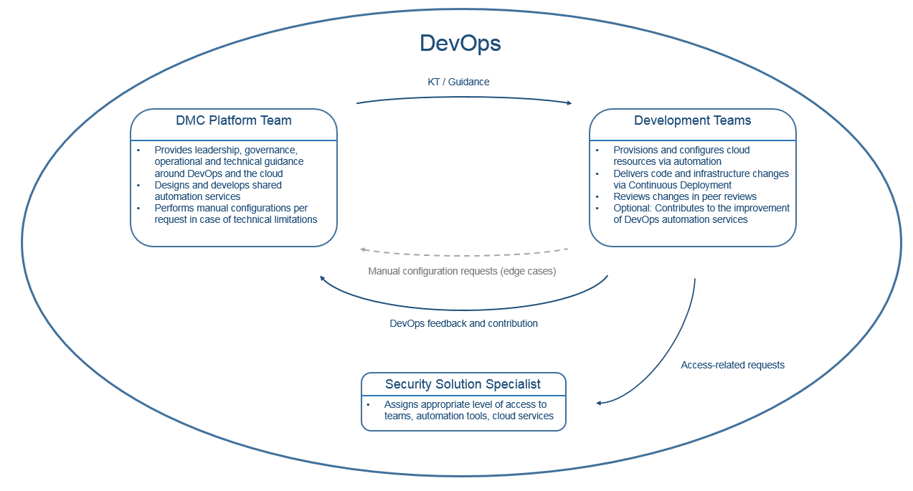

# DevOps Overview

## Introduction
This page provides a high-level overview of the software development process, security and DevOps concepts used for new projects in the global Digital Marketplace Center.

For more information on the actual implementation of the different items described in this document, visit [Starting a New Project](https://github.com/Dow/development/wiki/Starting-a-New-Project).

## Roles
The following list summarizes the different teams and roles that occur in this document:
- Architecture Specialist (AS)
    - Manages appropriate tasks/deliverables for the project
    - Manages product reviews with stakeholders
- DMC Platform Team
    - Oversees cloud operations and DevOps automation
    - Provides guidance to dev teams around DevOps, automation and the cloud
    - Primary contributor to developing and maintaining DevOps cloud infrastructure templates and automation tools
    - Final approver prior to Production deployments in Continuous Delivery Pipeline
- Lead developer
    - Manages appropriate tasks/deliverables for the project
    - Oversees delivery of features being developed in a sprint
    - Other responsibilities listed for Dev team
- Dev team
    - Development team
    - Develop features laid out in a sprint
    - Update AS and Lead developer on progress in stand up meetings
    - Empowered to provision resources and manage builds/deployments using DevOps automation
- DMC Tech Architecture Team
    - Assists with architecture reviews and guidance for solution designs
    - Reviews targeted frameworks, supported automation tools and cloud infrastructure components on a regular basis and makes decision on adding new ones
    - Members: Lead developers, Architecture Specialists, Platform team
- Security Solution Specialist
    - Security expert embedded at a specific DMC location
    - Assists teams with security-related project deliverables, such as Security Risk Management process, Risk Profile meeting, etc.
    - Ensures appropriate access level for team members, applications, automation tools, etc.
- TCS Support team - Tata Consulting Services support team
    - Handles production support in general

## Project Workflow

### Business requirements
- AS defines product requirements with business partner

### Project Planning
- Project is shaped and assigned to the appropriate AS and Lead Developer/Team
- Architecture Canvas and Technical Design reviews
- Initial sprint and capacity planning

Teams should not be starting any “meaningful” development, including provisioning cloud resources, before reviewing and executing these processes. An exception here can be the testing/evaluation of a project's design in an Azure sandbox environment, which is acceptable and encouraged.

### Project Startup Phase
The project startup phase typically takes place in Sprint 0. This phase typically includes the following steps:
- Request the Creation of App Registration(s) (optional)
- Request Azure Resource Groups for your project
- Set up build and release pipelines using Continuous Integration (CI) and Continuous Delivery (CD)
- Provision and configure cloud resources using Infrastructure as Code (IaC)
- Configure App Registrations using IaC
- Request adding necessary Azure SQL database roles and users for automation and development

In addition to the typical project startup activities, the delivery of the following Dow-specific project items need to be initiated early on:
- Application Portfolio entry
- Security Risk Management (starting with the Risk Profile meeting)
- Export Compliance Risk Assessment

It is important that you start with the above items as early as possible, as most of them typically take longer than the project startup phase to complete (multiple weeks).

### Development Phase
The software development process is described in the following diagram:

### Production Support
Primarily handled by TCS Support team

## DevOps

### Definitions

#### DevOps
DevOps is the union of people, process, and tools to enable continuous delivery of value to our end users. 

#### Continuous Integration
Continuous Integration (CI) is a development practice that requires developers to integrate code into a shared repository several times a day. Each check-in is then verified by an automated build, allowing teams to detect problems early.

#### Continuous Delivery
Continuous delivery (CD) is a series of practices designed to ensure that code can be rapidly and safely deployed to production by delivering every change to a production-like environment and ensuring business applications and services function as expected through automated testing. Since every change is delivered to a staging environment using complete automation, you can have confidence the application can be deployed to production with a push of a button when the business is ready.

### DevOps - People
People are the first and most important piece in a DevOps ecosystem. The following chart shows the teams directly involved in the 1DMC DevOps with their responsibilities and relationships from a DevOps standpoint:

Development teams are empowered to provision and configure complete cloud infrastructures using infrastructure as code. They leverage the shared tools designed and primarily developed by the DMC Platform team to continuously deliver code and infrastructure updates to the end customer.

It is the development team that sets up new projects (typically in Sprint 0) including infrastructure and pipeline configurations. The Platform team provides guidance to development teams around Continuous Delivery, cloud configurations and DevOps in general whenever necessary.
 
In addition, whenever technical limitations arise (for example, something cannot be automated), a request for manual configuration is sent from the development team to the DMC Platform team. The Platfrom team makes sure that the right configurations are in place for Test and Production environments in that scenario.

### DevOps - Process

#### Environments

A Sandbox environment is not part of any official DevOps pipeline and is used for Proof of Concepts (PoC) and experiments only.

A Dev environment is used as the first stage in the DevOps delivery pipeline and serves as a testing environment for Dev teams to test continuously integrated changes.

A Test environment is used to review application updates with internal/external stakeholders. It also serves as a staging environment prior to deployment to Prod.

A Prod environment is where the live application resides.

Dev, Test and Prod environments typically have the same architectures with similar configurations, ensuring consistency across environments and thereby increasing the number of successful production deployments. This level of consistency is achieved by using infrastructure automation and Continuous Delivery described in more detail in the upcoming sections.

#### Continuous Delivery
The following diagram illustrates the Continuous Delivery workflow including infrastructure automation:

Infrastucture and application code originate from two main version control sources: The shared Resource Library and a project repository specific to the solution. The Resource Library includes shared infrastructure templates that are maintained and published by the DMC Platform team. These templates are used and combined by a development team in the release pipeline of a project to implement custom cloud architectures. In addition to the Resource Library, development teams set up a project repository that includes the application code base and any custom infrastructure-related configurations that cannot be applied simply using infrastructure templates.

Both the Resource Library templates and the application code base undergo a code review, build and test process before getting published, i.e., made available, for deployments. Application code and configuration code changes originating from the project repository are delivered automatically to a Dev environment and can be manually sent further by the development team in a Continuous Delivery (CD) process. In contrast to application or configuration code deployments, changes related to infrastructure templates need to be triggered manually and can be sent further in the same CD pipeline as the one used for application and configuration updates.

#### Project Repository: Branching Strategy, Continuous Integration and Continuous Delivery
The following diagram describes the end-to-end CI/CD process for a project repository:

A project repository includes the application code along with any custom infrastructure configurations using a scripting language. In the Continuous Integration (CI) phase, a developer applies changes to the code base and/or infrastructure configurations on a feature branch and initiates a pull request (PR), i.e., peer review. Code validation and testing is triggered automatically as part of the PR. Testing includes a mandatory static code analysis test and any code-related unit and integration testing. Merging to Master branch requires an approval by at least another developer and successful code analysis and unit/integration tests. After merging, further validation and testing kick off and the necessary artifacts eventually get published for deployments. It is recommended that one create a PR early on in the feature development process so that others can provide timely feedback on the implementation details.

The Continuous Delivery (CD) phase is automatically triggered after the publishing step from CI is complete. The published artifact is first deployed to a Development (Dev) environment. The development team can decide to send the code or configuration update further to the Test environment once the changes are ready for review by the AS and typically one or more business partners. Once the AS and the Platform team approve the changes present in Test, they are automatically deployed to production.

The following diagram elaborates the CI pipeline for a project repository in some more detail:

The Resource Library uses the same branching strategy as the one described in the [previous section](#project-repository-branching-strategy-continuous-integration-and-continuous-delivery). Anyone having access to the repository can contribute to it. A code review by the DMC Platform team is mandatory and all infrastructure tests must succeed in addition. 

#### Resource Library: Branching Strategy, Continuous Integration and Publishing

In order to ensure reusability and consistency across environments and projects, Infrastructure as Code (IaC) is used for environment creation and modification. Furthermore, in order to simplify the provisioning of new cloud resources and provide default configurations, infrastructure templates are available originating from a centralized repository, called the [Resource Library (RL)](https://github.com/Dow/devops/blob/master/README.md#resource-library). This is a version control repository where IaC templates are stored. The templates are primarily developed and provided by the Platform team and go through rigorous infrastructure testing before making them available for use to development teams. These infrastructure templates are published by the DMC Platform team in Azure DevOps in the form of artifacts. A development team can combine these artifacts to implement custom cloud infrastructures required for their project in an Azure DevOps release pipeline.

The following integration pipeline is used for publishing IaC templates:

#### More on Approval Steps
The following workflow describes the approval process during release in more detail:

**Highlights:**

1. **CI/CD trigger on app build**: Triggers an automatic deployment to Dev as an integration environment for developers/project team review.
1. **Test pre-approval**: Performed by the current development team when they agree that the code is ready to deploy to Test.
1. **Test post-approval**: Performed by a project Stakeholder (or representative such as the AS) to either:
   - **approve** that the changes are good enough to deploy to production, or 
   - **reject** the changes to indicate we do not want to move the changes to Production
  
   **Important Note:** One of the actions above needs to be performed to allow the next package to be deployed to Test, because a pending post-approval indicates that stakeholders may be actively reviewing the application.
1. **Prod pre-approval**: Performed by the Platform Team (non-developer) to begin against the Production environment.

### DevOps - Tools

#### Primary Technology Stack
- Azure cloud (PaaS) – Cloud
- Azure Active Directory – Identity and Access Management
- .NET Core (preferred) and .NET – Software framework
- Entity Framework and Entity Framework Core – ORM framework
#### DevOps Tools
- Azure DevOps – Automation Management Tool, CI/CD
- Checkmarx – Static Code Scan Analysis
- Azure ARM templates – IaC
    For more information on currently supported Azure cloud resources, visit the [Resource Library documentation](https://github.com/Dow/devops/blob/master/README.md#resource-library)
- Azure Powershell – IaC and CaC scripting

## Security
### DevOps Security
The following workflow shows the basic DevOps workflow in a security context:

Dev teams have read-level access to cloud resources and resource groups by default. In Dev environments, a Dev team has restricted contributor-level access to cloud resources. A contributor can apply any modifications on the cloud resource directly from a local workstation using the Azure portal or other tools. This contributor access is restricted in a way such that developers cannot add or delete resources in a cloud resource group or remove the entire resource group itself. The creation or deletion of resources is supported through the CI/CD automation pipeline using IaC.

The Platform team has full contributor access on the cloud subscription level (including resource creation and deletion).

Both Dev and Platform teams have access to the automation management tool (Azure DevOps). Every change in configuration or code needs to go through the complete DevOps pipeline to release to production.

### Access to Environments
The chart below shows the access given to different roles in the context of environments:

Note that developers have elevated access in Dev environment to ensure fast-paced debugging and troubleshooting. This implies a need for discipline from any Dev team such that they solidify changes by updating IaC definitions and/or application code in the project repository once a problem has been resolved. This is a necessary step as the only way to apply the same changes in any environment other than Dev and Sandbox is to push updates through the DevOps pipeline. This strategy ensures consistency across environments while also giving Dev teams the flexibility to find the right solution to any problem within a reseasonable time.
